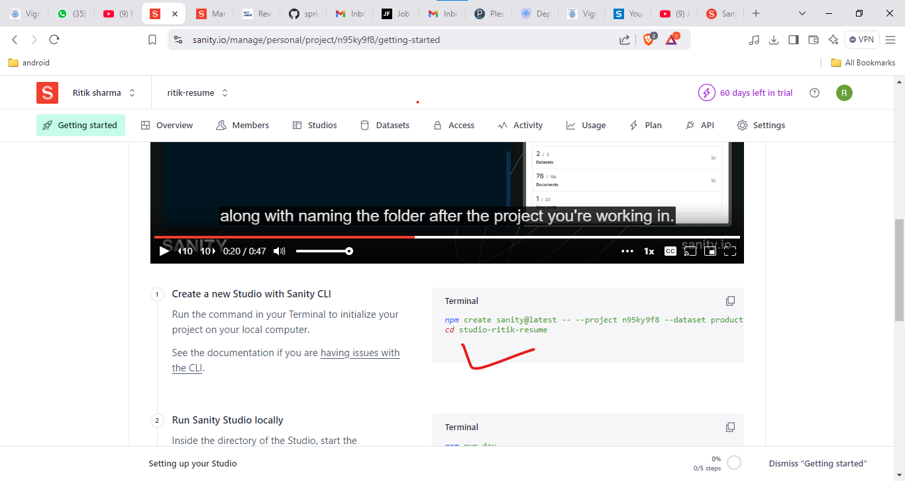
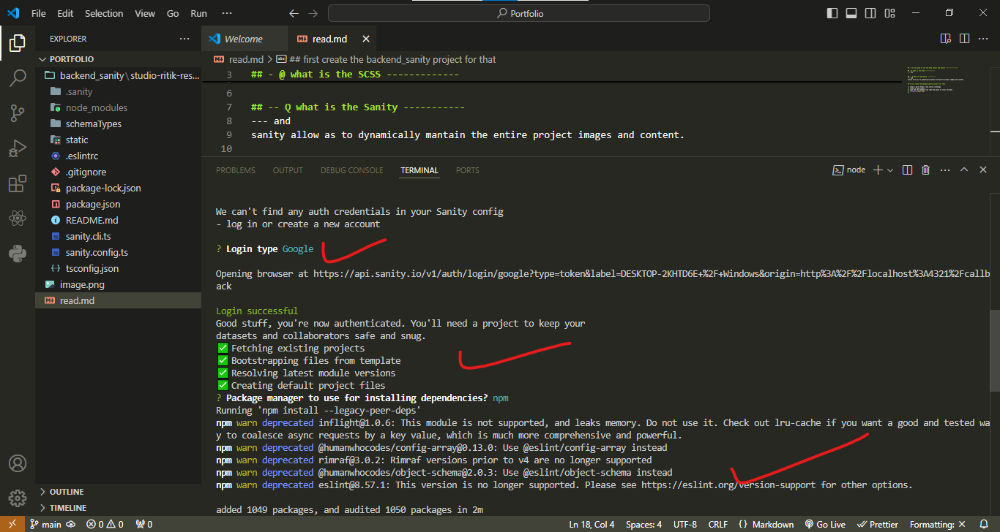
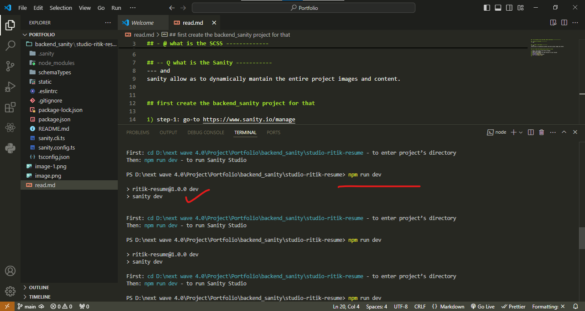
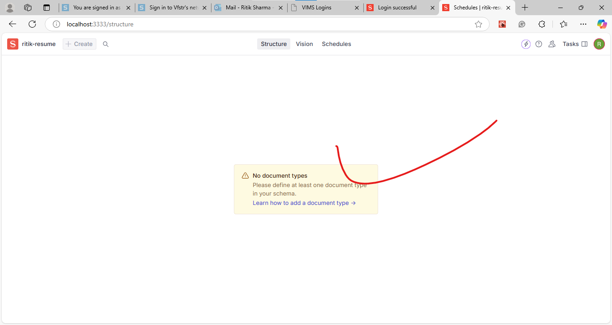

## - we are going to use the SCSS, React and Sanity -----------------

## - @ what is the SCSS -------------
--- and

## -- Q what is the Sanity -----------
--- and
sanity allow as to dynamically mantain the entire project images and content.

## first create the backend_sanity project for that

1) step-1: go-to https://www.sanity.io/manage
2) create a new project
3) copy the the command line code and paste to local ternimal
4) 
5) follow the below instructuon 
6) 
7) 
8) 
